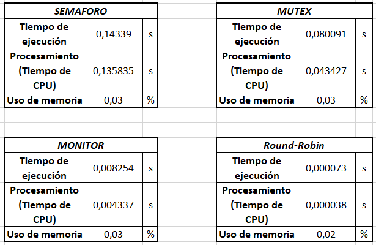
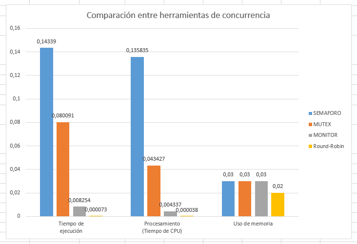
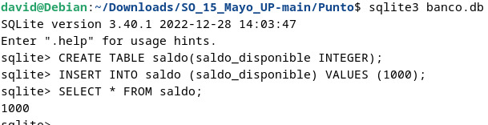
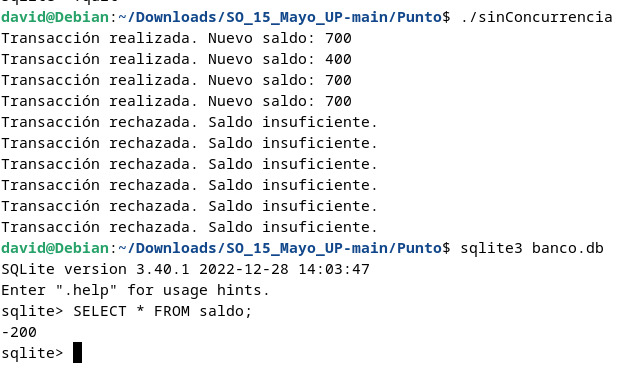
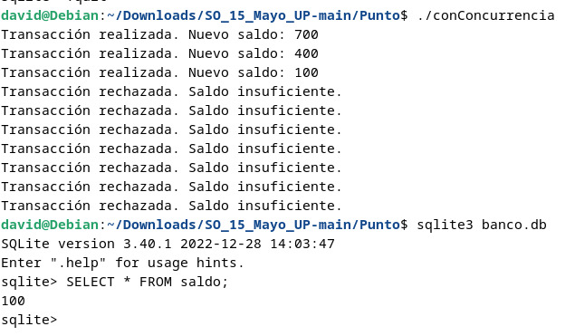

# Taller de Concurrencia

Este taller tiene como objetivo comprender y comparar diferentes métodos de concurrencia en la programación, así como implementar una aplicación que maneje concurrencia utilizando una base de datos y observar la diferencia con una aplicación sin concurrencia. 

### Integrantes
- David Arias Rueda
- Juan David Carvajal Lozano
- Paula Andrea Gómez Aldana

## Punto 1: Comparación de Métodos de Concurrencia

Ejecutaremos y compararemos los siguientes programas:

- `semaforo.c`
- `muteces.c`
- `monitor.c`
- `RR.c`

Para cada uno de estos programas, se medirán los siguientes parámetros:

1. **Tiempo de ejecución** (medido en segundos)
2. **Procesamiento (tiempo de CPU)** (medido en segundos)
3. **Uso de memoria** (medido en %)

### Ejecución de los Programas

1. Compila los programas:
    ```sh
    gcc -o semaforo semaforo.c -lpthread
    gcc -o muteces muteces.c -lpthread
    gcc -o monitor monitor.c -lpthread
    gcc -o RR RR.c -lpthread
    ```

2. Ejecuta los programas y mide los tiempos y uso de memoria:
    ```sh
    ./semaforo
    ./mutex
    ./monitor
    ./RR
    ```

3. Observa los datos tomados usando el siguiente comando en cada uno de los directorios:
   ```sh
   cat mediciones.txt
   ```

4. Registra los datos obtenidos y compáralos en tablas y gráficas.

   Los resultados se evidencian en las tablas a continuación:

   

   Y la siguiente es la gráfica correspondiente para una mejor comparación:

   

## Punto 2: Implementación de una aplicación con y sin concurrencia

Diseñar e implementar una aplicación de consulta a una Base de Datos (en este caso se pu
Se programará una aplicación en C utilizando SQLite para simular una operación bancaria. La base de datos contendrá una tabla que representa el saldo de una persona como se muestra a continuación:



Para evitar accesos concurrentes que puedan causar inconsistencias, se utilizará un mecanismo de concurrencia (en este caso, un mutex).

### Requisitos

1. **Base de Datos:** SQLite.
2. **Problema a Resolver:** Evitar accesos concurrentes no controlados a la actualización del saldo al realizar transacciones.
3. **Herramienta de Concurrencia:** Mutex.

### Ejecución del Programa sin Concurrencia

1. Compila el programa:
    ```sh
    gcc -o sinConcurrencia sinConcurrencia.c -lpthread -lsqlite3
    ```

2. Ejecuta el programa:
    ```sh
    ./sinConcurrencia
    ```

3. Observa el saldo que quedo registrado en la base de datos luego de la ejecución del programa:
   ```sh
   sqlite3 banco.db
   SELECT * FROM saldo;
   ```

El programa `sinConcurrencia.c` muestra el problema de acceder al saldo desde múltiples hilos sin control de concurrencia, lo que puede llevar a saldos negativos:



### Ejecución del Programa con Concurrencia

1. Compila el programa:
    ```sh
    gcc -o conConcurrencia conConcurrencia.c -lpthread -lsqlite3
    ```

2. Ejecuta el programa:
    ```sh
    ./conConcurrencia
    ```

3. Observa el saldo que quedo registrado en la base de datos luego de la ejecución del programa:
   ```sh
   sqlite3 banco.db
   SELECT * FROM saldo;
   ```

El programa con concurrencia (`conConcurrencia.c`) evita que el saldo llegue a ser negativo, demostrando así la eficacia de la implementación de mutex en este contexto:



### Explicación del Mutex

Los mutex (abreviatura de mutual exclusion) son objetos de sincronización que permiten a los hilos coordinar el acceso a recursos compartidos de manera segura, evitando condiciones de carrera y garantizando la consistencia de los datos. Cuando un hilo adquiere un mutex, bloquea el acceso a otros hilos hasta que lo libera, asegurando que solo un hilo pueda ejecutar una sección crítica del código a la vez.

En este escenario, estamos accediendo a una base de datos compartida desde múltiples hilos, y queremos asegurarnos de que solo un hilo pueda realizar una transacción a la vez para evitar problemas de consistencia en los datos. El uso de un mutex nos permite lograr esto de manera bastante directa y comprensible.

Otras opciones, como semáforos o barreras, podrían haber sido utilizadas también para lograr la misma funcionalidad. Sin embargo, en este caso, un mutex parece ser la opción más simple y apropiada dada la naturaleza de la operación de acceso a la base de datos.

## Conclusión

En este taller se ha demostrado la importancia de utilizar mecanismos de concurrencia para garantizar la integridad de los datos en aplicaciones que acceden a recursos compartidos. La comparación de diferentes métodos de concurrencia y la implementación de una solución práctica utilizando mutex han permitido comprender mejor cómo prevenir problemas como las condiciones de carrera y asegurar la consistencia de los datos.
